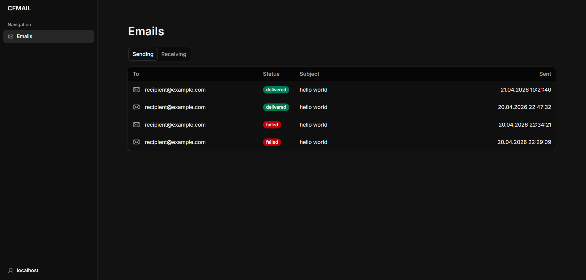

<div align="center">
  <h1>cfmail</h1>
  <p><em>A self-hosted Resend alternative, built on Cloudflare Workers.</em></p>
  <p>Send and receive emails using your own Cloudflare infrastructure.</p>
</div>



## Setup

**Important**: Deployment is only the first step. You must complete the post-deployment configuration below for the project to function.

### 1. Deploy
Click the button below to provision resources automatically:

  [](https://deploy.workers.cloudflare.com/?url=https://github.com/eckoln/cfmail)

### 2. Configure Cloudflare Access

To secure your Worker and enable API access:
* Go to **Settings > Domains & Routes** in your Worker dashboard.
* Enable **One-click Cloudflare Access** on your domain.
* **Action Required:** Copy `POLICY_AUD` and `TEAM_DOMAIN` from the modal and set them as **Secrets** in your Worker settings.

### 3. Enable Email Routing & Sending

* **Receive emails:** Go to **Email Service > Email Routing**. Create a "Catch-all" rule pointing to this Worker.
* **Send emails:** Go to **Email Service > Email Sending**. Onboard your domain.

## API Authentication (Service Auth)

Use a Service Token to bypass the Access login challenge for programmatic requests.

### Step 1: Create Token

1. Go to **Zero Trust Dashboard > Access > Service Tokens**.
2. Click **Create Service Token**.
3. Save your **Client ID** and **Client Secret** securely.

### Step 2: Authorize Access

1. Navigate to **Access > Applications** and edit your Worker application.
2. Under the **Policies** tab, add a new policy:
   * **Action:** `Service Auth`
   * **Include:** `Service Token` (Select your newly created token).

### Step 3: Usage Example

Include the following headers in your requests to authenticate with your Worker:

```bash
curl "https://<id>.workers.dev/api/emails" \
  -H "CF-Access-Client-Id: <YOUR_CLIENT_ID>" \
  -H "CF-Access-Client-Secret: <YOUR_CLIENT_SECRET>" \
  -d '{
    "from": "hello@yourdomain.com",
    "to": ["user@example.com"],
    "subject": "Hello from cfmail",
    "html": "<h1>It works!</h1>"
  }'
